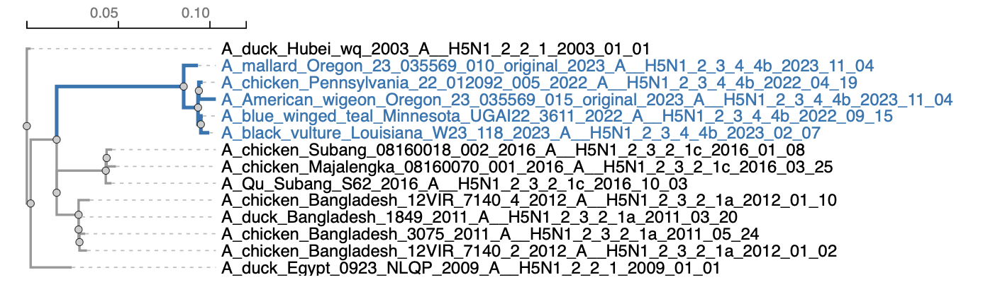
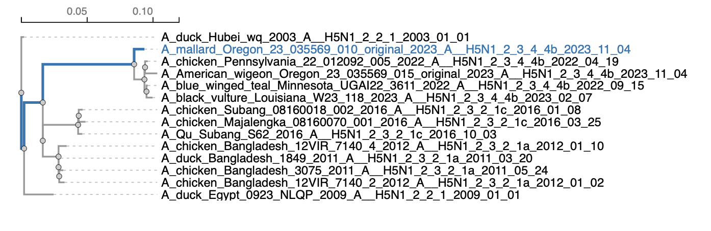

## Standard MG94 fit

This analysis fits the [Muse Gaut](https://www.ncbi.nlm.nih.gov/pubmed/7968485) (+ GTR) model of codon substitution to an alignment and a tree and reports parameter estimates and trees scaled on expected number of synonymous and non synonymous substitutions per nucleotide site.

### Quick reference by analysis type (the `--type` argument)

#### `--type` global (default)

A single &omega; value is estimated from the entire tree. It is shared by all branches.

```
$hyphy FitMG94.bf --alignment HA.fas --tree HA.nwk

...

### Fitting Standard MG94
* Log(L) = -4377.13, AIC-c =  8834.67 (40 estimated parameters)
* non-synonymous/synonymous rate ratio =   0.1557 (95% profile CI   0.1296-  0.1851)

...
```

#### `--type` partitioned 

If the some of the tree branches are annotated using `{}`, then this mode will fit a separate &omega; to each branch partition (all branches in a partition have the same &omega;) For example (note that the "empty" partition refers to all unlabeled branches), in the tree below there are two partitions (blue branches are labeled `2334b`).



```
$hyphy FitMG94.bf --alignment HA.fas --tree HA-labeled.nwk --type partitioned
...

### Fitting Standard MG94
* Log(L) = -4374.53, AIC-c =  8831.49 (41 estimated parameters)
* non-synonymous/synonymous rate ratio for ** =   0.1913 (95% profile CI   0.1520-  0.2368)
* non-synonymous/synonymous rate ratio for *2344b* =   0.1143 (95% profile CI   0.0830-  0.1523)
...
```

#### `--type` local 

Every branch in the tree has its own synonymous (&alpha;) and non-synonymous (&beta;) evolutionary rates, and consequently its own &omega; := &beta; / &alpha;. This model is also sometimes referred to as the free-ratio model, especially in PAML literature.

```
$hyphy FitMG94.bf --alignment HA.fas --tree HA-labeled.nwk --type local
...

### Fitting Standard MG94
* Log(L) = -4358.70, AIC-c =  8846.45 (64 estimated parameters)

### Estimating confidence intervals for dN/dS along each branch

|                      Branch                      |     Length     |     dN/dS      |Approximate dN/dS CI|
|:------------------------------------------------:|:--------------:|:--------------:|:------------------:|
|A_mallard_Oregon_23_035569_010_original_2023_A_...|     0.010      |     0.071      |   0.009 - 0.215    |
|A_chicken_Pennsylvania_22_012092_005_2022_A__H5...|     0.002      |     0.000      |   0.000 - 0.192    |
|A_American_wigeon_Oregon_23_035569_015_original...|     0.011      |     0.081      |   0.020 - 0.210    |
|                      Node7                       |     0.001      |     0.000      |   0.000 - 0.896    |
|A_blue_winged_teal_Minnesota_UGAI22_3611_2022_A...|     0.001      |     0.000      |   0.000 - 0.395    |
|A_black_vulture_Louisiana_W23_118_2023_A__H5N1_...|     0.005      |     0.204      |   0.051 - 0.530    |
|                      Node10                      |     0.002      |     0.000      |   0.000 - 0.256    |
|                      Node6                       |     0.009      |     0.188      |   0.060 - 0.424    |
|                      Node4                       |     0.080      |     0.123      |   0.083 - 0.173    |
|A_chicken_Subang_08160018_002_2016_A__H5N1_2_3_...|     0.004      |     0.205      |   0.034 - 0.635    |
|A_chicken_Majalengka_08160070_001_2016_A__H5N1_...|     0.006      |     0.414      |   0.148 - 0.890    |
|                      Node15                      |     0.001      |     0.000      |   0.000 - 0.894    |
|A_Qu_Subang_S62_2016_A__H5N1_2_3_2_1c_2016_10_0...|     0.004      |     0.200      |   0.033 - 0.619    |
|                      Node14                      |     0.031      |     0.047      |   0.016 - 0.102    |
|A_chicken_Bangladesh_12VIR_7140_4_2012_A__H5N1_...|     0.007      |     0.135      |   0.034 - 0.350    |
|A_duck_Bangladesh_1849_2011_A__H5N1_2_3_2_1a_20...|     0.002      |     0.205      |   0.012 - 0.902    |
|A_chicken_Bangladesh_3075_2011_A__H5N1_2_3_2_1a...|     0.004      |     0.081      |   0.005 - 0.356    |
|A_chicken_Bangladesh_12VIR_7140_2_2012_A__H5N1_...|     0.005      |     0.405      |   0.126 - 0.943    |
|                      Node23                      |     0.001      |     0.000      |   0.000 - 0.809    |
|                      Node21                      |     0.000      |     1.000      |0.000 - 10000.000...|
|                      Node19                      |     0.015      |     0.272      |   0.131 - 0.488    |
|                      Node13                      |     0.028      |     0.167      |   0.090 - 0.277    |
|                      Node3                       |     0.015      |     0.381      |   0.198 - 0.650    |
|A_duck_Egypt_0923_NLQP_2009_A__H5N1_2_2_1_2009_...|     0.025      |     0.216      |   0.121 - 0.351    |
|  A_duck_Hubei_wq_2003_A__H5N1_2_2_1_2003_01_01   |     0.006      |     1.016      |   0.408 - 2.017    |

...
```

#### `--type` lineage

This option fits a collection of models, one for each leaf/tip in the tree. Given a tip, the entire root-to-tip path is selected and a lineage-wide &omega; is estimated for this path (example in the following image)



The rest of the branches each have their own &omega; (which are nuisance parameters and are not reported). This process is repeated for each tip.

```
$hyphy FitMG94.bf --alignment HA.fas --tree HA-labeled.nwk --type lineage

### Fitting Standard MG94
* Log(L) = -4358.70, AIC-c =  8846.45 (64 estimated parameters)

### Estimating confidence intervals for dN/dS along each lineage

|                     Lineage                      |  Root-to-tip   |     dN/dS      |Approximate dN/dS CI|
|:------------------------------------------------:|:--------------:|:--------------:|:------------------:|
|A_mallard_Oregon_23_035569_010_original_2023_A_...|     0.105      |     0.143      |   0.105 - 0.191    |
|A_chicken_Pennsylvania_22_012092_005_2022_A__H5...|     0.107      |     0.147      |   0.107 - 0.194    |
|A_American_wigeon_Oregon_23_035569_015_original...|     0.116      |     0.143      |   0.106 - 0.188    |
|A_blue_winged_teal_Minnesota_UGAI22_3611_2022_A...|     0.108      |     0.146      |   0.107 - 0.194    |
|A_black_vulture_Louisiana_W23_118_2023_A__H5N1_...|     0.112      |     0.152      |   0.112 - 0.200    |
|A_chicken_Subang_08160018_002_2016_A__H5N1_2_3_...|     0.079      |     0.139      |   0.096 - 0.193    |
|A_chicken_Majalengka_08160070_001_2016_A__H5N1_...|     0.082      |     0.151      |   0.107 - 0.207    |
|A_Qu_Subang_S62_2016_A__H5N1_2_3_2_1c_2016_10_0...|     0.079      |     0.140      |   0.097 - 0.194    |
|A_chicken_Bangladesh_12VIR_7140_4_2012_A__H5N1_...|     0.066      |     0.223      |   0.158 - 0.303    |
|A_duck_Bangladesh_1849_2011_A__H5N1_2_3_2_1a_20...|     0.060      |     0.236      |   0.166 - 0.324    |
|A_chicken_Bangladesh_3075_2011_A__H5N1_2_3_2_1a...|     0.063      |     0.221      |   0.155 - 0.303    |
|A_chicken_Bangladesh_12VIR_7140_2_2012_A__H5N1_...|     0.064      |     0.245      |   0.174 - 0.332    |
|A_duck_Egypt_0923_NLQP_2009_A__H5N1_2_2_1_2009_...|     0.025      |     0.216      |   0.121 - 0.351    |
|  A_duck_Hubei_wq_2003_A__H5N1_2_2_1_2003_01_01   |     0.006      |     1.018      |   0.409 - 2.020    |

```

## Invokation

This analysis has one **required** argument

- `--alignment` the alignment file and tree (in FASTA, PHYLIP, MEGA or NEXUS formats)

HyPhy will write Markdown output to the screen and a JSON file with detailed fit results. 
See example at the end of the document

### Complete options list 

```
Available analysis command line options
---------------------------------------
Use --option VALUE syntax to invoke
If a [reqired] option is not provided on the command line, the analysis will prompt for its value
[conditionally required] options may or not be required based on the values of other options

rooted
	Accept rooted trees
	default value: No

code
	Which genetic code should be used
	default value: Universal

alignment [required]
	An in-frame codon alignment in one of the formats supported by HyPhy

tree [conditionally required]
	A phylogenetic tree
	applies to: Please select a tree file for the data:

type
	Model type: global (single dN/dS for all branches) or local (separate dN/dS)
	default value: terms.global [computed at run time]
	applies to: Model Type

frequencies
	Equilibrium frequency estimator
	default value: CF3x4

lrt
	Perform LRT to test which for dN/dS == 1 (global model only)
	default value: No

output
	Write the resulting JSON to this file (default is to save to the same path as the alignment file + 'MG94.json')
	default value: fitter.codon_data_info[terms.json.json] [computed at run time]

save-fit
	Save MG94 model fit to this file (default is not to save)
	default value: /dev/null
```

### Model type

* `global` : dN/dS ratio is shared by all branches
* `local` : synonymous and non-synonymous rates are inferred separately for each branch

### Frequencies

* `CF3x4` : corrected F3x4 estimator
* `F3x4` : standard F3x4 estimator
* `F1x4` : standard F1x4 estimator 

See [this paper](https://journals.plos.org/plosone/article?id=10.1371/journal.pone.0011230) for details on CF3x4 and references to other estimators. 
 

##Example run 


```
hyphy FitMG94.bf --alignment CD2.nex --lrt Yes
```

--- 

Analysis Description
--------------------
Fit an MG94xREV model with several selectable options frequency
estimator and report the fit results including dN/dS ratios, and
synonymous and non-synonymous branch lengths

- __Requirements__: in-frame codon alignment and a phylogenetic tree

- __Written by__: Sergei L Kosakovsky Pond

- __Contact Information__: spond@temple.edu

- __Analysis Version__: 0.1


>code –> Universal

>alignment –> CD2.nex
>Loaded a multiple sequence alignment with **10** sequences, **187** codons, and **1** partitions from `/Users/sergei/Development/hyphy-analyses/FitMG94/CD2.nex`

>type –> global

>frequencies –> CF3x4

>output –> /Users/sergei/Development/hyphy-analyses/FitMG94/CD2.nex.FITTER.json


### Obtaining branch lengths and nucleotide substitution biases under the nucleotide GTR model
* Log(L) = -3532.32, AIC-c =  7112.86 (24 estimated parameters)

### Fitting Standard MG94
* Log(L) = -3467.00, AIC-c =  6997.08 (31 estimated parameters)
* non-synonymous/synonymous rate ratio =   0.9946

### Running the likelihood ratio tests for dN/dS=1

>Testing _non-synonymous/synonymous rate ratio_ == 1

Likelihood ratio test for _non-synonymous/synonymous rate ratio == 1_, **p =   0.9441**.

### **Synonymous tree** 
((((PIG:0.04984627036053099,COW:0.06403799551220878)Node3:0.02628206419849433,HORSE:0.05462441699415268,CAT:0.07072042159004242)Node2:0.01660606657724141,((RHMONKEY:0.0009603406563057343,BABOON:0.0004580422901830288)Node9:0.006698871580291192,(HUMAN:0,CHIMP:0.0004723658790532533)Node12:0.004621767454293861)Node8:0.02833161659368989)Node1:0.07347572784488095,RAT:0.01731155959494845,MOUSE:0.03105524853252499)

### **Non-synonymous tree** 
((((PIG:0.1429749925174539,COW:0.1836813840427375)Node3:0.07538533785866487,HORSE:0.15668024015681,CAT:0.2028487121410343)Node2:0.04763149233539052,((RHMONKEY:0.002754563122905964,BABOON:0.001313811294966029)Node9:0.0192144990415551,(HUMAN:0,CHIMP:0.001354895913669316)Node12:0.01325670230522016)Node8:0.08126410744860087)Node1:0.2107518087683148,RAT:0.04965507119491638,MOUSE:0.08907635204099817)

>save-fit –> /dev/null

### Writing detailed analysis report to `/Users/sergei/Development/hyphy-analyses/FitMG94/CD2.nex.FITTER.json'

##Local model fits 

Specifying `--type local` will fit a model where each branch has its own &alpha; (dS) and &beta; (dN) rates. Further specifying `--lrt Yes` will test whether or not dN ≠ dS along a given branch. The `JSON` output file will include such branch level parameters in the corresponding dictionary:

```
"branch attributes":{
   "0":{
     "BABOON":{
       "Confidence Intervals":{
         "LB":0,
         "MLE":0,
         "UB":0.6860409126311118
        },
       "LRT":{
         "Corrected P-value":1,
         "FDR":0.5456841416635031,
         "LRT":2.669070286591705,
         "p-value":0.1023157765619068
        },
       "Nucleotide GTR":0.001679681026555922,
       "Standard MG94":0.001815827116959503,
       "dN":1.267499201636807e-10,
       "dS":0.008603986131448501,
       "nonsynonymous":1e-10,
       "original name":"BABOON",
       "synonymous":0.001815827116959503
      },
```

### Example invokation

```
hyphy FitMG94.bf --alignment CD2.nex --type local --lrt Yes
```

Analysis Description
--------------------
Fit an MG94xREV model with several selectable options frequency
estimator and report the fit results including dN/dS ratios, and
synonymous and non-synonymous branch lengths. v0.2 adds LRT test for
dN/dS != 1. v0.3 adds LRT test support for dN/dS != 1 for local models

- __Requirements__: in-frame codon alignment and a phylogenetic tree

- __Written by__: Sergei L Kosakovsky Pond

- __Contact Information__: spond@temple.edu

- __Analysis Version__: 0.3

rooted: No

>code –> Universal
>Loaded a multiple sequence alignment with **10** sequences, **187** codons, and **1** partitions from `/Users/sergei/Development/hyphy-analyses/FitMG94/CD2.nex`

>type –> local

>frequencies –> CF3x4

>lrt –> Yes


### Obtaining branch lengths and nucleotide substitution biases under the nucleotide GTR model

>kill-zero-lengths –> Yes
* Log(L) = -3532.32, AIC-c =  7112.86 (24 estimated parameters)
* 1 partition. Total tree length by partition (subs/site)  1.694

### Fitting Standard MG94
* Log(L) = -3450.61, AIC-c =  6995.58 (46 estimated parameters)

### Running the likelihood ratio tests for dN/dS=1 and estimating confidence intervals for dN/dS along each branch

|            Branch            |     Length     |     dN/dS      |Approximate dN/dS CI|LRT p-value dN != dS|
|:----------------------------:|:--------------:|:--------------:|:------------------:|:------------------:|
|             PIG              |     0.192      |     1.345      |   0.966 - 1.809    |       0.3794       |
|             COW              |     0.253      |     1.918      |   1.456 - 2.479    |       0.0516       |
|            Node5             |     0.103      |     1.482      |   0.836 - 2.304    |       0.4878       |
|            HORSE             |     0.209      |     1.245      |   0.926 - 1.635    |       0.4828       |
|             CAT              |     0.277      |     1.604      |   1.241 - 2.038    |       0.1190       |
|            Node4             |     0.066      |     0.664      |   0.275 - 1.202    |       0.5664       |
|           RHMONKEY           |     0.004      |10000000000.0...|0.000 - 10000.000...|       0.2845       |
|            BABOON            |     0.002      |     0.000      |   0.000 - 0.686    |       0.1023       |
|            Node11            |     0.026      |     0.401      |   0.139 - 0.817    |       0.1605       |
|            HUMAN             |     0.000      |     1.000      |0.000 - 10000.000...|       1.0000       |
|            CHIMP             |     0.002      |10000000000.0...|0.000 - 10000.000...|       0.4355       |
|            Node14            |     0.018      |     0.368      |   0.052 - 0.924    |       0.2652       |
|            Node10            |     0.110      |     1.915      |   1.270 - 2.728    |       0.2750       |
|            Node3             |     0.290      |     0.432      |   0.317 - 0.573    |       0.0015       |
|             RAT              |     0.066      |     1.089      |   0.610 - 1.717    |       0.9070       |
|            MOUSE             |     0.122      |     0.525      |   0.343 - 0.755    |       0.1057       |

### **Synonymous tree** 
((((PIG:0.03937408670808301,COW:0.03878451353271926)Node5:0.0195616708158665,HORSE:0.04559327378804292,CAT:0.04931224992892905)Node4:0.02284730872773409,((RHMONKEY:0,BABOON:0.001815827116959503)Node11:0.01202579316224195,(HUMAN:0,CHIMP:0)Node14:0.008700053742021586)Node10:0.01688166070650646)Node3:0.1292228327513776,RAT:0.01590572225225523,MOUSE:0.04854724584993934)

### **Non-synonymous tree** 
((((PIG:0.1521831461112254,COW:0.2138117251333718)Node5:0.08333270489251039,HORSE:0.1632014620903291,CAT:0.2273175155627533)Node4:0.04358798007485778,((RHMONKEY:0.003666894925291958,BABOON:0)Node11:0.01385522359919074,(HUMAN:0,CHIMP:0.001837936132619463)Node14:0.00920920510293554)Node10:0.09291437133059131)Node3:0.1603787381398532,RAT:0.04977984176707917,MOUSE:0.07324864703524042)
**Combined tree** 
((((PIG:0.1915572328193086,COW:0.2525962386660908)Node5:0.102894375708377,HORSE:0.2087947358783719,CAT:0.2766297654916826)Node4:0.06643528880259186,((RHMONKEY:0.003666894925291958,BABOON:0.001815827116959503)Node11:0.02588101676143268,(HUMAN:0,CHIMP:0.001837936132619463)Node14:0.01790925884495711)Node10:0.1097960320370977)Node3:0.2896015708912303,RAT:0.06568556401933438,MOUSE:0.1217958928851798)

### Writing detailed analysis report to `/Users/sergei/Development/hyphy-analyses/FitMG94/CD2.nex.FITTER.json'

##Lineage model fits 

Specifying `--type lineage` will fit a series of models (one per tip) where each lineage (root-to-tip path) has &omega; shared by all branches on the path (other branches follow the local model, i.e., each have a separate &omega;). Further specifying `--lrt Yes` will test whether or not dN ≠ dS along a given lineage. The `JSON` output file will include such lineage level parameters in the corresponding dictionary for each tip

```
{
  "0": {
    "BABOON": {
      "Confidence Intervals": {
        "LB": 0.4636129090762545,
        "MLE": 0.5781364977774703,
        "UB": 0.7107235391153578
      },
      "Lineage dN/dS": 0.5781364977774703,
      "Nucleotide GTR": 0.001678804792294136,
      "Standard MG94": 0.001816952271827546,
      "dN": 1.267559344528279e-10,
      "dS": 0.008607790674541258,
      "nonsynonymous": 1e-10,
      "original name": "BABOON",
      "synonymous": 0.001816952271827545
    },
    "CAT": {
      "Confidence Intervals": {
        "LB": 0.6538772341990953,
        "MLE": 0.7842287585236669,
        "UB": 0.9307827352260568
      },
      "Lineage dN/dS": 0.7842287585236669,
      "Nucleotide GTR": 0.2659387293604716,
      "Standard MG94": 0.2764022448618857,
      "dN": 0.2878233953083185,
      "dS": 0.2337158252693683,
      "nonsynonymous": 0.2270689704200254,
      "original name": "CAT",
      "synonymous": 0.04933327444186014
    },

```

Trees reported by this model and `dN, dS` etc entries are from the **local** model.

### Example invokation

```
$hyphy FitMG94.bf --alignment CD2.nex --type lineage --lrt Yes

Analysis Description
--------------------
Fit an MG94xREV model with several selectable options frequency
estimator and report the fit results including dN/dS ratios, and
synonymous and non-synonymous branch lengths. v0.2 adds LRT test for
dN/dS != 1. v0.3 adds LRT test support for dN/dS != 1 for local models.
v0.4 adds the lineage option

- __Requirements__: in-frame codon alignment and a phylogenetic tree

- __Written by__: Sergei L Kosakovsky Pond

- __Contact Information__: spond@temple.edu

- __Analysis Version__: 0.4

rooted: No
type: lineage

>code => Universal
>Loaded a multiple sequence alignment with **10** sequences, **187** codons, and **1** partitions from `/Users/sergei/Development/hyphy-analyses/FitMG94/CD2.nex`

>frequencies => CF3x4

>lrt => Yes


### Obtaining branch lengths and nucleotide substitution biases under the nucleotide GTR model

>kill-zero-lengths => Yes
* Log(L) = -3532.32, AIC-c =  7112.86 (24 estimated parameters)
* 1 partition. Total tree length by partition (subs/site)  1.694

### Fitting Standard MG94
* Log(L) = -3450.58, AIC-c =  6995.54 (46 estimated parameters)

### Running the likelihood ratio tests for dN/dS=1 and estimating confidence intervals for dN/dS along each lineage

|                     Lineage                      |  Root-to-tip   |     dN/dS      |Approximate dN/dS CI|LRT p-value dN != dS|
|:------------------------------------------------:|:--------------:|:--------------:|:------------------:|:------------------:|
|                       PIG                        |     0.650      |     0.786      |   0.658 - 0.930    |       0.1649       |
|                       COW                        |     0.712      |     0.863      |   0.730 - 1.017    |       0.4330       |
|                      HORSE                       |     0.565      |     0.695      |   0.571 - 0.834    |       0.0511       |
|                       CAT                        |     0.633      |     0.784      |   0.654 - 0.931    |       0.1868       |
|                     RHMONKEY                     |     0.429      |     0.611      |   0.491 - 0.750    |       0.0191       |
|                      BABOON                      |     0.427      |     0.579      |   0.464 - 0.711    |       0.0090       |
|                      HUMAN                       |     0.417      |     0.593      |   0.474 - 0.730    |       0.0140       |
|                      CHIMP                       |     0.419      |     0.602      |   0.483 - 0.741    |       0.0168       |
|                       RAT                        |     0.066      |     1.052      |   0.588 - 1.657    |       0.9160       |
|                      MOUSE                       |     0.122      |     0.524      |   0.343 - 0.755    |       0.1056       |

### **Synonymous tree** 
((((PIG:0.03937976910961005,COW:0.03878196934160791)Node5:0.01953264636417628,HORSE:0.04562115918704893,CAT:0.04933327412757849)Node4:0.02285717254032199,((RHMONKEY:0,BABOON:0.001816952236730559)Node11:0.01202854619327834,(HUMAN:0,CHIMP:0)Node14:0.008705466300081375)Node10:0.01688638729474507)Node3:0.129231123591656,RAT:0.01589072745913837,MOUSE:0.04854992814928286)

### **Non-synonymous tree** 
((((PIG:0.1521317258493709,COW:0.213987693332625)Node5:0.0832913223464546,HORSE:0.1631767143137914,CAT:0.227068967648879)Node4:0.04356531440008079,((RHMONKEY:0.003668077279446832,BABOON:0)Node11:0.01385849565766886,(HUMAN:0,CHIMP:0.00183741124397444)Node14:0.009198322274120194)Node10:0.09291875412141247)Node3:0.1604448934102589,RAT:0.04977900720298319,MOUSE:0.07320834508305805)
**Combined tree** 
((((PIG:0.1915114949589812,COW:0.2527696626742328)Node5:0.1028239687106309,HORSE:0.2087978735008403,CAT:0.2764022417764573)Node4:0.06642248694040283,((RHMONKEY:0.003668077279446832,BABOON:0.001816952236730559)Node11:0.0258870418509472,(HUMAN:0,CHIMP:0.00183741124397444)Node14:0.01790378857420156)Node10:0.1098051414161575)Node3:0.2896760170019151,RAT:0.06566973466212156,MOUSE:0.1217582732323408)

### Writing detailed analysis report to `/Users/sergei/Development/hyphy-analyses/FitMG94/CD2.nex.FITTER.json'

```

