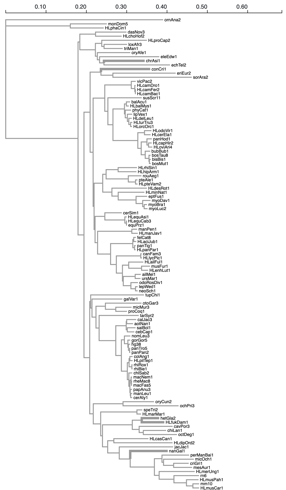

### RER: relative evolutionary rate 

This analysis implements a relative evolutionary rate test inspired by [`RERConverge`](https://academic.oup.com/bioinformatics/article/35/22/4815/5514536), also see [walkthrough](https://clark.genetics.utah.edu/wp-content/uploads/2020/11/FullWalkthroughUTD.html).

A key use-case is a study of how evolutionary rates associate with phenotypes, e.g. the subterranean phenotype, is [here](hhttps://elifesciences.org/articles/25884).

This analysis requires an alignment of **protein** sequences, a _reference_ tree **with given branch lengths**, and a list of branches designated at the `test set`.

The reference tree is viewed as providing _relative_ branch lengths, e.g. estimated from a genome-wide species tree alignment. 

The `RER` analysis fits the following **four** models and compares them in a variety of ways. A companion visualization module can be found at [https://observablehq.com/@spond/rer-viewer](https://observablehq.com/@spond/rer-viewer)


#### Proportional

A single alignment-wide branch length scaling parameter <tt><b>R<sub>shared</sub></b></tt> is inferred. It simply scales all the branches relative to the input tree. 

#### Proportional partitioned

Two alignment-wide branch length scaling parameters <tt><b>R<sub>test</sub>, R<sub>background</sub></b></tt> are inferred: one for the test branches, and one for the background branches.

#### Unconstrained Test

All background branches are scaled with the same factor <tt><b>R<sub>background</sub></b></tt>. Every branch in the `test` set gets its own (independent) branch length.

#### Unconstrained

All branch lengths are inferred independently.

#### Summary of models

`T` the number of test branches
`B` the number of background branches

| Model      | Test Branches | Background Branches | # Parameters |
| ----------- | ----------- | ----------- | ----------- |
| Proportional      | <b>R<sub>shared</sub></b> x ref    | <b>R<sub>shared</sub></b> x ref | 1 |
| Proportional Partitioned     | <b>R<sub>test</sub></b> x ref     | <b>R<sub>background</sub></b> x ref | 2 |
| Unconstrained Test      | Independent       | <b>R<sub>background</sub></b> | T + 1 |
| Unconstrained      | Independent       | Independent | T + B |

These models form a nested chain:

`Proportional` &subset; `Proportional Partitioned` &subset; `Unconstrained Test` &subset; `Unconstrained`

### Example 1

An example invocation for a gene (`LIM2`) that was found to be accelerated in subterranean lineages in [Partha et al](hhttps://elifesciences.org/articles/25884).

```
hyphy RER.bf 
--alignment data/LIM2.fa 
--tree data/mam120master.tre 
--branches nanGal1 
--branches hetGla2 
--branches HLfukDam1 
--branches conCri1 
--branches chrAsi1 
--labeling-strategy none
```

Test branches are shown as thicker branches below (colors -- ratio to reference tree branch lengths; blue < 1, grey = 1, red > 1)

| Reference      | Proportional (R<sub>shared</sub> = 0.17) |
| ----------- | ----------- | 
| |  |
| Proportional Partitoned <br> (R<sub>test</sub> = 1.5, R<sub>background</sub> = 0.17)      | Unconstrained Test (R<sub>background</sub> = 0.17) |
| |  |
| Unconstrained      | 
| |

### Example 2

An example invocation for a gene (`LIM2`) that was found to be decelerated in subterranean lineages in [Partha et al](hhttps://elifesciences.org/articles/25884).

```
hyphy RER.bf 
--alignment data/CHST8.fa 
--tree data/mam120master.tre 
--branches nanGal1 
--branches hetGla2 
--branches HLfukDam1 
--branches conCri1 
--branches chrAsi1 
--labeling-strategy none
```

Test branches are shown as thicker branches below (colors -- ratio to reference tree branch lengths; blue < 1, grey = 1, red > 1)

| Reference      | Proportional (R<sub>shared</sub> = 0.47) |
| ----------- | ----------- | 
| |  |
| Proportional Partitoned <br> (R<sub>test</sub> = 0.34, R<sub>background</sub> = 0.47)      | Unconstrained Test (R<sub>background</sub> = 0.48) |
| |  |
| Unconstrained      | 
| |

### Hypothesis testing

The `RER` analysis will conduct all six nested model pairs likelihood ratio tests (LRT) and report the results as Holm-Bonferroni corrected p-values.

### Example: `LIM2`

### LRT test results between pairs of nested models
> p-values corrected using the Holm-Bonferroni procedure (raw values in parentheses)

|                  Null                  |        Proportional Partitioned        |           Unconstrained Test           |             Unconstrained              |
|----------------------------------------|----------------------------------------|----------------------------------------|----------------------------------------|
|              Proportional              |          0.0000000 (0.00000)           |          0.0000000 (0.00000)           |          0.0000000 (0.00000)           |
|        Proportional Partitioned        |                  N/A                   |          0.0000285 (0.00003)           |          0.0000000 (0.00000)           |
|           Unconstrained Test           |                  N/A                   |                  N/A                   |          0.0000000 (0.00000)           |

### Example: `CHST8`

### LRT test results between pairs of nested models
> p-values corrected using the Holm-Bonferroni procedure (raw values in parentheses)

|                  Null                  |        Proportional Partitioned        |           Unconstrained Test           |             Unconstrained              |
|----------------------------------------|----------------------------------------|----------------------------------------|----------------------------------------|
|              Proportional              |          0.0060750 (0.00202)           |          0.0138966 (0.00695)           |          0.0000000 (0.00000)           |
|        Proportional Partitioned        |                  N/A                   |          0.1688029 (0.16880)           |          0.0000000 (0.00000)           |
|           Unconstrained Test           |                  N/A                   |                  N/A                   |          0.0000000 (0.00000)           |


#### Test Interpretation for key pairs

|                  Null                  |        Alternative         |   Hypothesis |
|----------------------------------------|----------------------------------------|----------------------------------------|
|  Proportional | Proportional Partitioned | Are average relative (to reference) evolutionary rates different between the two sets of branches? This is the test most directly comparable to the `RERConverge` test |
|  Proportional Partitioned | Unconstrained Test | Is there evidence of relative rate (branch length) variation in the test clade, assuming that the background is proportional to the reference tree? |
|  Unconstrained Test | Unconstrained | Is there evidence of relative rate (branch length) variation in the background branches? |

### Key analysis options

#### Substitution model 

`--model [one of LG, WAG, JTT, JC69, mtMet, mtVer, mtInv, gcpREV, HIVBm, HIVWm, GTR]`
	
`WAG` is the default model.	

#### Site-to-site rate variation

`--rv [one None, Gamma, GDD]`

`None` is the default

`--rate-classes [2-10]` 

`4` is the default

#### Labeling strategy

This option determines how `RER` approaches automatically internal nodes to the test set.

1. `none` : do not label any internal branches automatically
2. `all-descendants` : [default] label an internal node if and only if ALL of its descendants are labeled
3. `some-descendants` : label an internal node if and only if ANY of its descendants are labeled
4. `parsimony` : label internal nodes using parsimony


