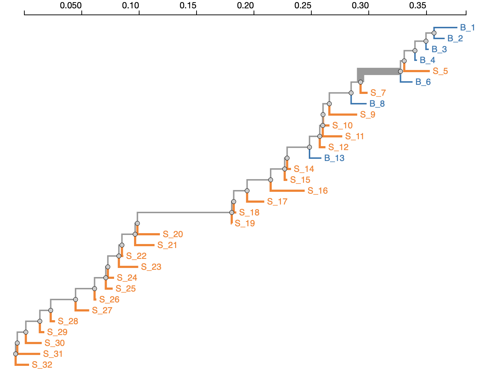
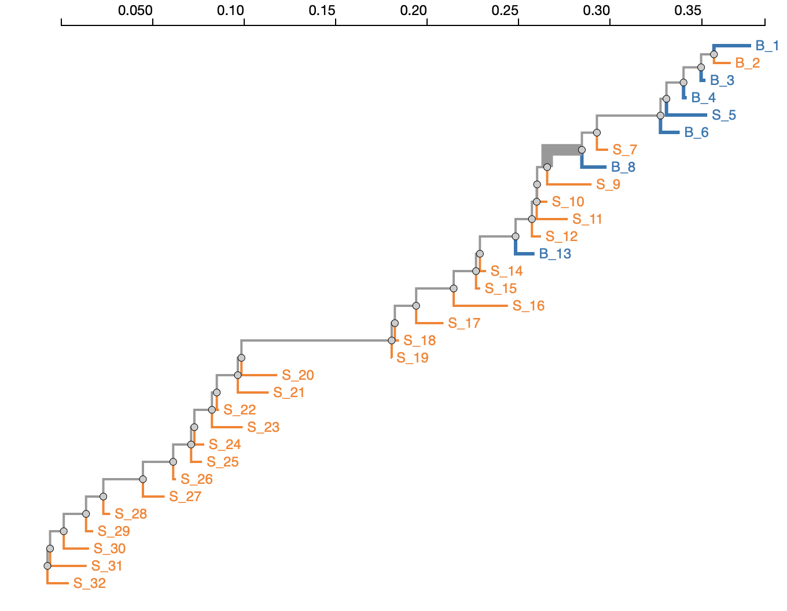

### Modified Slatkin-Maddison method

We modify the standard [Slatkin-Maddison](https://www.ncbi.nlm.nih.gov/pubmed/2599370) method, hereafter referred to as `SM[S]`, where [S] stands for _structured_ as follows. 

Consider a tree with leaves grouped into **K≥2** categories, each with its own label.

1. We begin by reconstructing the labels for internal tree nodes using maximum parsimony. This step produces an estimate of the number of migrations, **M<sub>obs</sub>**. This is the primary test statistic of the set. 

2. In the standard SM, the next step is to approximate the null distribution of the test statistic, through generating **N** replicates of the data, where each replicate is constructed by randomly permuting leaf labels, and inferring the number of migrations using the randomized relabeling, **M<sub>0</sub><sup>i</sup>**.

3. Significance is determined by computing the fraction of **M<sub>0</sub><sup>i</sup>** replicates that are **as small or smaller** than **M<sub>obs</sub>**. This is the p-value for inferring as few or fewer migrations under complete panmixia.

4. In SM[S], we obtain another sampling distribution via a different permutation approach, which respects the structure of the tree, and works like this (also see examples below).

	1. Traverse the tree _post order_ (left subtree, right subtree, internal node).
	2. For each internal node `n` which has more than two descendants, draw a random number `r` in [0,1]. If `r` ≤ `R(n)`, where `R(n)` is threshold (see notes below on choosing `R`), then permute the labels of all the available (see definition below) leaves below node `n`, and fix the order of permuted leaves for the rest of the procedure. If `r` > `R(n)`, then do nothing (see example below)
	3. Once the tree has been fully traversed, infer the number of migrations using the randomized relabeling **M<sub>s</sub><sup>i</sup>**
	4. Repeat the procedure in steps 1-3 for **N** replicates. 
	5. Determine significance thus: compute the 90-th percentile of the **M<sub>s</sub><sup>i</sup>** distribution, call it **M<sub>structured</sub>**. Use it to compute the p-value as the fraction of **M<sub>0</sub><sup>i</sup>** replicates that are **as small or smaller** than **M<sub>structured</sub>**. Generally, **M<sub>structured</sub> ≥ M<sub>obs</sub>**; they are equal when **R(n)=0**, therefore structured SM[S] p-values will be **higher** that SM p-values, and the test will be more conservative. 

	
#### Example for permutation generation

Consider the highlighted internal branch in the following figure (color = label) and assume we have determined that the leaves below this branch will be permuted . To do so, we generate a random relabeling on 6 leaves (B\_1, B\_2, B\_3, B\_4, S\_5, B\_6), depicted in the next figure. .

Next assume we have determined that the next branch to be permuted is highlighted in the above figure. Because we already permuted some of the leaves below that branch, the labeling of those leaves is fixed, and the only labels we can reassort would be for S\_7 and B\_8.

#### Choosing R(n)

`R(n)`, (the `--weight` options in the analysis) the permutation threshold can be chosen in one of two ways. It can be fixed at a constant value for all nodes (e.g. **0.2**, which is the default), or can be a function of the bootstrap support for the node, **0≤bs(n)≤1**  (currently **Max(default_weight, bs(n)<sup>2</sup>** if **bs(n)≥0.7**, otherwise **bs(n)**). Setting R(n) = 0 will recapitculate the standard SM test. When boostrap values are used, effectively what happens is that the population stucture of subtrees rooted at well-supported nodes is preserved by the permutation.

### Running SM[S]

SM[S] is implemented in the 2.5.x version of [HyPhy](www.hyphy.org)

To run SM[S], exectute (see an example below).

```
hyphy sm required options
```

The analyses requires a Newick tree string (optionally with bootstrap values for internal branches), and assumes that sequences can be partitioned into 2 or more groups using [regular expressions](https://www.regular-expressions.info)

For example, consider:

```
hyphy sm --tree data/A.nwk --description-1 "CSF" --regexp-1 "C$" \
--description-2 "Plasma" --regexp-2 "P$" 
```

This executes the SM (both standard and structured) on the tree in `data/A.nwk` with 2 branch groups (the default), where the first group is named `CSF` and includes all leaves whose names end in `C`, and the second group is named `Plasma` and includes all leaves whose names end in `P`.

The screen output is as follows and shows evidence of compartmentalization by both tests. 

----
Analysis Description
--------------------
This analysis implements canonical and modified versions of the
Slatkin-Maddison phylogeny based test for population segregation. The
test estimates the minimum number of migration events using maximum
parsimony, and then evaluating whether or not this number is lower than
expected in a panmictic or unstructured population using permutation
tests

- __Requirements__: a phylogenetic tree with leaf names that can be partitioned into sets
using regular expressions

- __Citation__: *A cladistic measure of gene flow inferred from the phylogenies of
alleles* (1989), Genetics 123(3):603-613

- __Written by__: Sergei L Kosakovsky Pond

- __Contact Information__: spond@temple.edu

- __Analysis Version__: 0.1


### Using a tree with **26** leaves

`x_US_x_A_01C,x_US_x_A_01P,x_US_x_A_08P,x_US_x_A_11P,x_US_x_A_14C,x_US_x_A_09P,x_US_x_A_12P,x_US_x_A_07C,x_US_x_A_02P,x_US_x_A_05P,x_US_x_A_04P,x_US_x_A_03P,x_US_x_A_14P,x_US_x_A_13P,x_US_x_A_10P,x_US_x_A_15P,x_US_x_A_06P,x_US_x_A_04C,x_US_x_A_05C,x_US_x_A_12C,x_US_x_A_11C,x_US_x_A_13C,x_US_x_A_08C,x_US_x_A_09C,x_US_x_A_10C,x_US_x_A_15C`

>How many branch classes are there (permissible range = [2,26], default value = 2, integer): groups: 2
>Please provide a description for group of branches 1 : description-1: CSF
>Please provide a regular expression to select the _CSF_ branches : regexp-1: C$
>Please provide a description for group of branches 2 : description-2: Plasma
>Please provide a regular expression to select the _Plasma_ branches : regexp-2: P$
* Branch set _CSF_ has 12 branches.
* Branch set _Plasma_ has 14 branches.
>How many bootstrap replicates (permissible range = [1,1000000], default value = 1000, integer): replicates: 1000
>Probability of branch selection  (permissible range = [0,1], default value = 0.2): weight: 0.2

### Inferred **4** migration events
Based on **1000** leaf label permutations, the standard (full panmixia) p-value for compartmentalization test was <  0.001

### The null distribution of migration events had mean _8.922_, median _9.000_, and 2.5% - 97.5% range of  6.000-11.000

### Based on **1000** _structured_ permutations, the p-value for compartmentalization test was <  0.035

> This p-value is derived by comparing the distribution of migration events from the panmictic reshuffle to the 90% percentile of the simulated distribution of expected migrations if leaf labels are permuted partially respecting subtree structure (block permutations), which results in **6** expected migrations

### List of individual branches contributing to compartmentalization signal
|     Branch     |   Migrations   |  Panmictic P   |  Structured P  |
|:--------------:|:--------------:|:--------------:|:--------------:|
|     Node49     |       4        |      0.0010    |      0.0350    |
|     Node1      |       4        |      0.0060    |      ---       |
|     Node2      |       4        |      0.0100    |      ---       |
|     Node3      |       4        |      0.0190    |      ---       |
|     Node4      |       4        |      0.0350    |      ---       |
|     Node7      |       3        |      0.0270    |      ---       |
|     Node9      |       3        |      0.0380    |      ---       |
|     Node23     |       1        |      0.0460    |      ---       |
|     Node24     |       0        |      0.0100    |      ---       |

##### Saving detailed report as a JSON file to `/Users/sergei/Development/hyphy-analyses/SlatkinMaddison/data/A.nwk.json`
----

The `.json` file can be visualized at [http://vision.hyphy.org/Slatkin](http://vision.hyphy.org/Slatkin), and also at [https://observablehq.com/@spond/node-level-slatkin-maddison-support](https://observablehq.com/@spond/node-level-slatkin-maddison-support) to view branch-level support. For example, in the table above, the subtree starting at one internal node (`Node49`) has significantly fewer inferred migrations than expected under the null model.

----

Other examples (simulated data from [Zarate et al 2007](https://www.ncbi.nlm.nih.gov/pmc/articles/PMC1900087/)

#### Low migration rate 

```
hyphy sm --tree data/mig00005.nwk --description-1 "Group1" --regexp-1 "1$" \
--description-2 "Group2" --regexp-2 "2$" 
```
---
### Inferred **2** migration events
Based on **1000** leaf label permutations, the standard (full panmixia) p-value for compartmentalization test was <  0.001

### The null distribution of migration events had mean _13.523_, median _14.000_, and 2.5% - 97.5% range of 10.000-17.000

### Based on **1000** _structured_ permutations, the p-value for compartmentalization test was <  0.003

---

#### High migration rate
```
hyphy sm --tree data/mig01_0.nwk --description-1 "Group1" --regexp-1 "1$" \
--description-2 "Group2" --regexp-2 "2$" 
```

---
### Inferred **14** migration events
Based on **1000** leaf label permutations, the standard (full panmixia) p-value for compartmentalization test was <  0.673

### The null distribution of migration events had mean _13.703_, median _14.000_, and 2.5% - 97.5% range of 10.000-17.000

### Based on **1000** _structured_ permutations, the p-value for compartmentalization test was <  0.861


---

#### Complete analysis options

```
$hyphy sm --help

Available analysis command line options
---------------------------------------
Use --option VALUE syntax to invoke
If a [reqired] option is not provided on the command line, the analysis will prompt for its value
[conditionally required] options may or not be required based on the values of other options

tree [required]
	The Newick tree string defining the topology to use for testing

groups
	The number of compartments to test
	defaut value: 2

"description-"+(sm.i+1) [computed at run time] [required]
	"Description for sequences in compartment "+(sm.i+1) [computed at run time]

"regexp-"+(sm.i+1) [computed at run time] [required]
	"Regular expression to select the branches in compartment _"+sm.tag+"_" [computed at run time]

replicates
	The number of bootstrap replicates
	defaut value: 1000

weight
	Probability of branch selection for structured permutation [0-1]; 0 = classical Slatkin-Maddison, 1 = fully structured
	defaut value: 0.2

use-bootstrap
	Use bootstrap weights to respect well supported clades
	defaut value: Yes

output
	Write the JSON file here (default is to save to the same path as the tree file + '_SM.json')
	defaut value: sm.json_file [computed at run time]

``