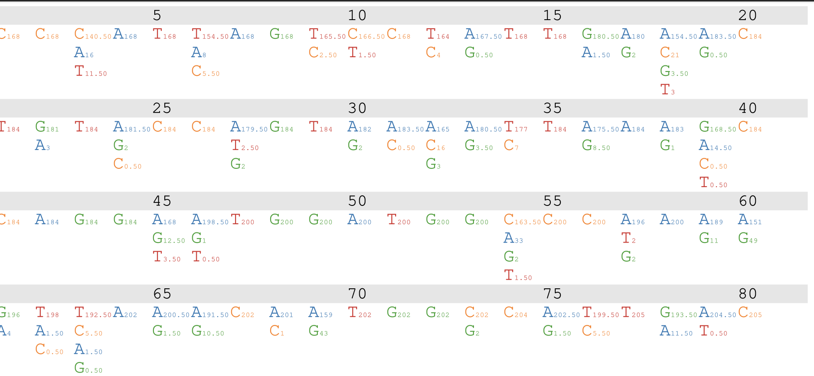
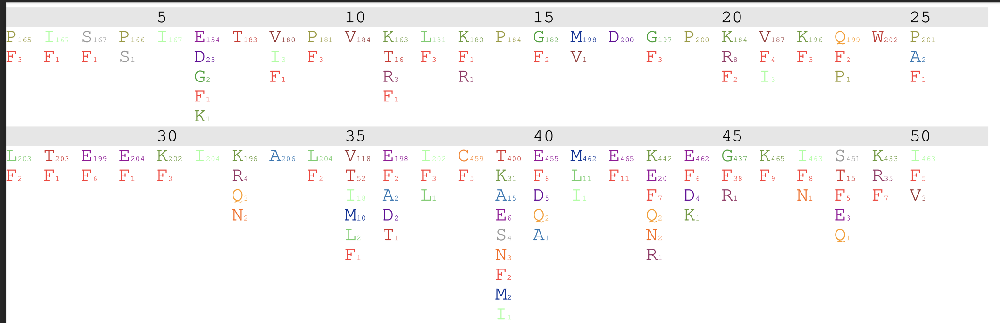

## Generate an alignment visualization

This script generates a PostScript file containing a simple visualization of per-column alignment content, like so

 

### Example

```
hyphy alignment-viz.bf --alignment test/HIV_RT.nex 
			--output output/nt.ps 						--font-size 12 
			--ticks 5  
```

#### Output
```
Available analysis command line options
---------------------------------------
Use --option VALUE syntax to invoke
If a [reqired] option is not provided on the command line, the analysis will prompt for its value
[conditionally required] options may or not be required based on the values of other options

alignment [required]
	The alignment to visualize

site-filter
	Use this string to filter sites
	default value: None

sequence-filter
	Use this string to filter sequences
	default value: None

output
	Write the PostScript to
	default value: av_viz.alignment[terms.data.file]+".ps" [computed at run time]

font-size
	Baseline font size [4-36]
	default value: 14 [computed at run time]

ticks
	Display site indices every X sites [3-20]
	default value: 5 [computed at run time]

```

### Tips

1. To convert PostScript to PDF (or other formats) consider using [GhostScript](https://www.ghostscript.com).

2. Amino-acid alignments can be displayed as well (see `output/aa.ps`).
 

3. To display a subset of sites, you can use `site-filter`, e.g., `--site-filter '0-100'` or `--site-filter '0,5,10-20'`

4. To displace a subset of sequences, you can use `sequence-filter`, e.g., `--sequence-filter '0-10'` or `--sequence-filter '0,1,2,3'`
