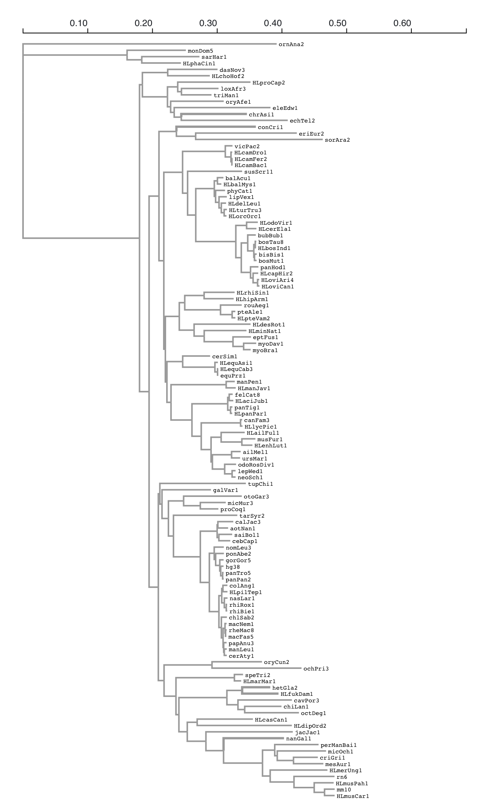
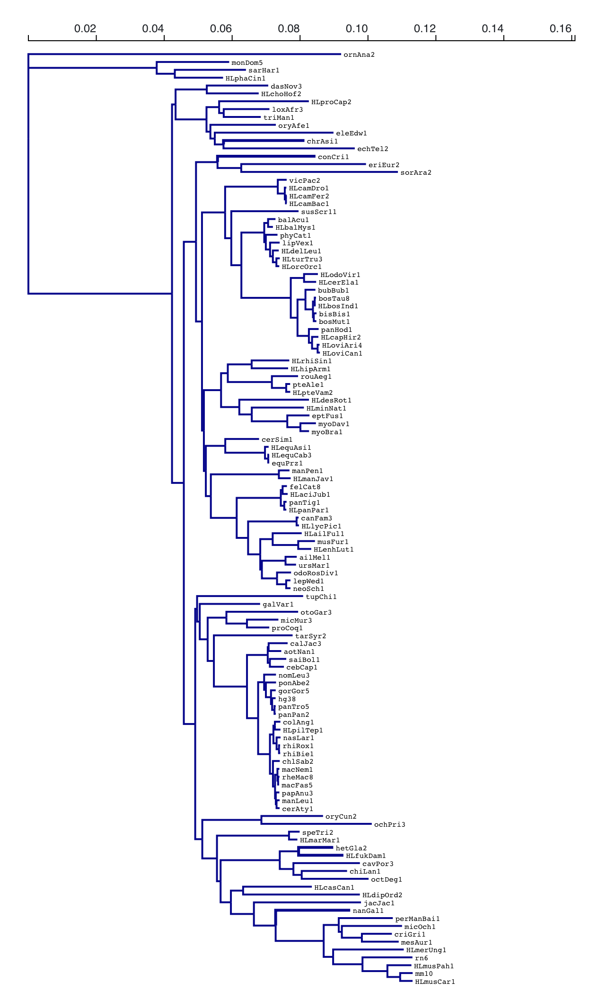
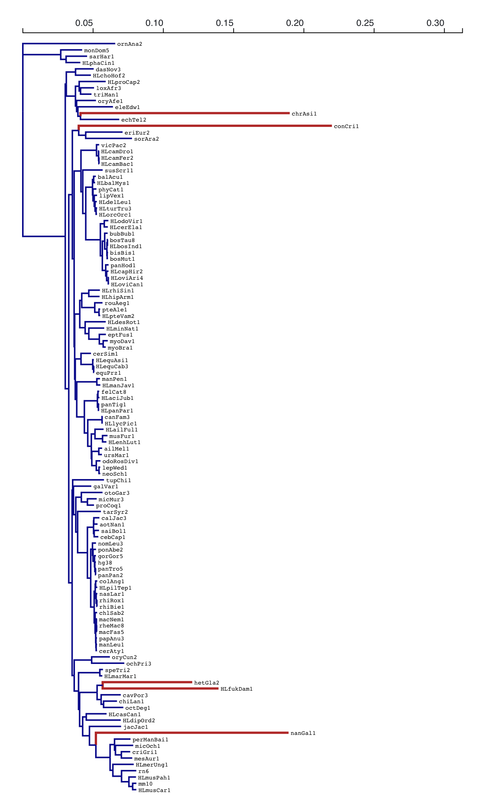
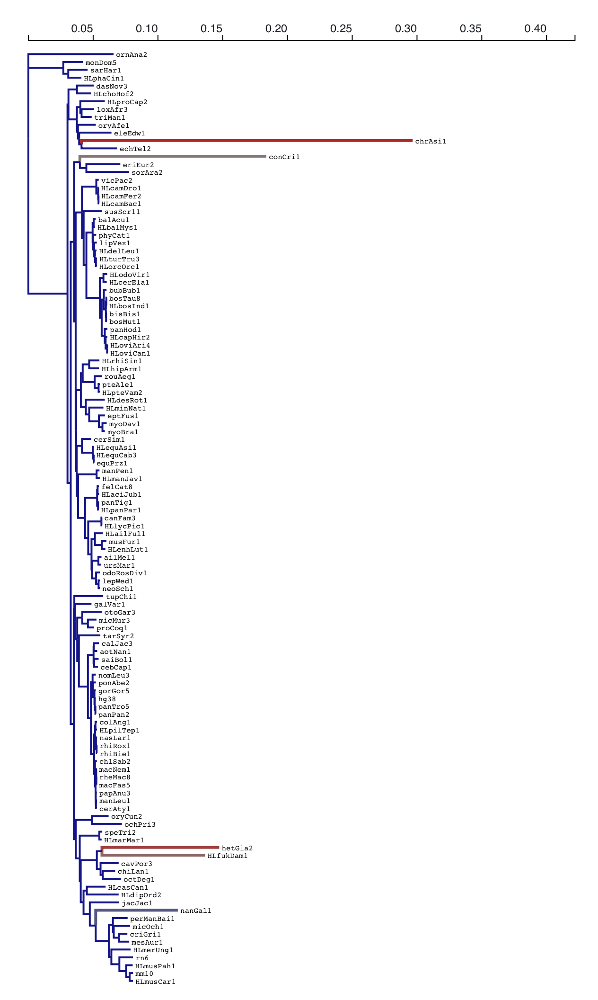
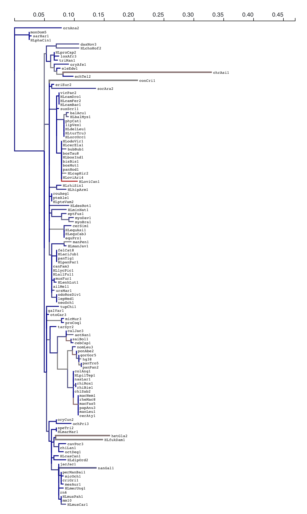

### MoleRate: relative evolutionary molecular rate 

This analysis implements a relative evolutionary rate test inspired by [`RERConverge`](https://academic.oup.com/bioinformatics/article/35/22/4815/5514536), also see [walkthrough](https://clark.genetics.utah.edu/wp-content/uploads/2020/11/FullWalkthroughUTD.html).

A key use-case is a study of how evolutionary rates associate with phenotypes, e.g. the subterranean phenotype, is [here](hhttps://elifesciences.org/articles/25884).

This analysis requires an alignment of **protein** or **nucleotide** sequences, a _reference_ tree **with given branch lengths**, and a list of branches designated at the `test set`.

The reference tree is viewed as providing _relative_ branch lengths, e.g. estimated from a genome-wide species tree alignment. 

The `MoleRate` analysis fits the following **four** models (one is optional) and compares them in a variety of ways. A companion visualization module can be found at [https://observablehq.com/@hyphy/molerate](https://observablehq.com/@hyphy/molerate)

The output is a `JSON` file following the schema described in [JSON.md](JSON.md)


#### Proportional

A single alignment-wide branch length scaling parameter <tt><b>R<sub>shared</sub></b></tt> is inferred. It simply scales all the branches relative to the input tree. 

#### Proportional partitioned

Two alignment-wide branch length scaling parameters <tt><b>R<sub>test</sub>, R<sub>background</sub></b></tt> are inferred: one for the test branches, and one for the background branches.

#### Unconstrained Test

All background branches are scaled with the same factor <tt><b>R<sub>background</sub></b></tt>. Every branch in the `test` set gets its own (independent) branch length.

#### Unconstrained

All branch lengths are inferred independently.
This model can be skipped with the `--full-model No` option

#### Summary of models

`T` the number of test branches
`B` the number of background branches

| Model      | Test Branches | Background Branches | # Parameters |
| ----------- | ----------- | ----------- | ----------- |
| Proportional      | <b>R<sub>shared</sub></b> x ref    | <b>R<sub>shared</sub></b> x ref | 1 |
| Proportional Partitioned     | <b>R<sub>test</sub></b> x ref     | <b>R<sub>background</sub></b> x ref | 2 |
| Unconstrained Test      | Independent       | <b>R<sub>background</sub></b> | T + 1 |
| Unconstrained      | Independent       | Independent | T + B |

These models form a nested chain:

`Proportional` &subset; `Proportional Partitioned` &subset; `Unconstrained Test` &subset; `Unconstrained`

### Example 1

An example invocation for a gene (`LIM2`) that was found to be accelerated in subterranean lineages in [Partha et al](hhttps://elifesciences.org/articles/25884).

```
hyphy molerate.bf 
--alignment data/LIM2.fa 
--tree data/mam120master.tre 
--branches nanGal1 
--branches hetGla2 
--branches HLfukDam1 
--branches conCri1 
--branches chrAsi1 
--labeling-strategy none
--output results/LIM2.molerate.json
```

Test branches are shown as thicker branches below (colors -- ratio to reference tree branch lengths; blue < 1, grey = 1, red > 1)

| Reference      | Proportional (R<sub>shared</sub> = 0.17) |
| ----------- | ----------- | 
| |  |
| Proportional Partitoned <br> (R<sub>test</sub> = 1.5, R<sub>background</sub> = 0.17)      | Unconstrained Test (R<sub>background</sub> = 0.17) |
| |  |
| Unconstrained      | 
| |


### Hypothesis testing

The `MoleRate` analysis will conduct all available nested model pairs likelihood ratio tests (LRT) and report the results as Holm-Bonferroni corrected p-values.

### Example: `LIM2`

### Fitting different models of branch length constraint to the data

|                 Model                  |      L(test)       |   Rel to ref   | L(background)  |   Rel to ref   |     Log(L)     |     AIC-c      |
|----------------------------------------|--------------------|----------------|----------------|----------------|----------------|----------------|
|               Reference                |         0.5934     |       1        |       9.7938   |       1        |      N/A       |      N/A       |
|        Proportional Partitioned        |         0.8712     |      1.468     |       1.6434   |      0.168     |   -3178.326    |    6398.697    |
|              Proportional              |         0.1395     |      0.235     |       2.3016   |      0.235     |   -3322.762    |    6685.564    |
|           Unconstrained Test           |         0.9005     |      1.517     |       1.6430   |      0.168     |   -3165.215    |    6380.493    |
|             Unconstrained              |         0.8983     |      1.514     |       1.6645   |      0.170     |   -2973.630    |    6461.595    |

### LRT test results between pairs of nested models
> p-values corrected using the Holm-Bonferroni procedure (raw values in parentheses)

|                  Null                  |        Proportional Partitioned        |           Unconstrained Test           |             Unconstrained              |
|----------------------------------------|----------------------------------------|----------------------------------------|----------------------------------------|
|              Proportional              |          0.0000000 (0.00000)           |          0.0000000 (0.00000)           |          0.0000000 (0.00000)           |
|        Proportional Partitioned        |                  N/A                   |          0.0000285 (0.00003)           |          0.0000000 (0.00000)           |
|           Unconstrained Test           |                  N/A                   |                  N/A                   |          0.0000000 (0.00000)           |


#### Test Interpretation for key pairs

|                  Null                  |        Alternative         |   Hypothesis |
|----------------------------------------|----------------------------------------|----------------------------------------|
|  Proportional | Proportional Partitioned | Are average relative (to reference) evolutionary rates different between the two sets of branches? This is the test most directly comparable to the `RERConverge` test |
|  Proportional Partitioned | Unconstrained Test | Is there evidence of relative rate (branch length) variation in the test clade, assuming that the background is proportional to the reference tree? |
|  Unconstrained Test | Unconstrained | Is there evidence of relative rate (branch length) variation in the background branches? |

### Example 2

An example invocation for a `LIM2`, this time using a different substitution model (`LG`) and performing branch-level tests and skipping the unconstrained model fit.
```
hyphy molerate.bf 
--alignment data/LIM2.fa 
--tree data/mam120master.tre 
--model LG
--branches nanGal1 
--branches hetGla2 
--branches HLfukDam1 
--branches conCri1 
--branches chrAsi1 
--labeling-strategy none
--branch-level-analysis Yes
--full-model No
--output results/LIM2.molerate.LG-test.json
```

The key difference is the following section.

### Single-branch signal
> p-values corrected using the Holm-Bonferroni procedure
> (*) marks a possible outlier branch which is mostly responsible for rate differences
> (#) marks a branch which contributes to the rate difference signal

|                      Branch                      |   Single branch    |All but this branch |
|--------------------------------------------------|--------------------|--------------------|
|                  (#) HLfukDam1                   |       0.000000     |       0.000000     |
|                   (#) chrAsi1                    |       0.000000     |       0.000000     |
|                   (#) conCri1                    |       0.000000     |       0.000000     |
|                   (#) hetGla2                    |       0.000000     |       0.000000     |
|                   (#) nanGal1                    |       0.000485     |       0.000000     |


### Key analysis options

#### Substitution model 

(protein data only; nucleotide data are handled with the GTR model)

`--model [one of LG, WAG, JTT, JC69, mtMet, mtVer, mtInv, gcpREV, HIVBm, HIVWm, GTR]`
	
`WAG` is the default model for protein data.

#### Site-to-site rate variation

`--rv [one None, Gamma, GDD]`

`None` is the default

`--rate-classes [2-10]` 

`4` is the default

#### Labeling strategy

This option determines how `MoleRate` approaches automatically internal nodes to the test set.

1. `none` : do not label any internal branches automatically
2. `all-descendants` : [default] label an internal node if and only if ALL of its descendants are labeled
3. `some-descendants` : label an internal node if and only if ANY of its descendants are labeled
4. `parsimony` : label internal nodes using parsimony

#### Branch-level tests

When `--branch-level-tests Yes` option is selected, `MoleRate` will conduct `2xT` (2 per tested branch) additional LRT tests to estimate the effect that adding or removing a particular branch has on the `Proportional Partitioned: Proportional` model test. For each test branch, one additional model is fitted, `Proportional + 1`, which is the same as the `Proportional` except that one designated test branch has an unconstrained branch length. `Proportional + 1` vs `Proportional` is the **single branch** test, and if it's significant, then allowing that single branch to have its own relative rate is sufficient to detect rate differences between test and background branches. `Proportional + 1` vs `Unconstrained test` (**all but this branch**) can be used to determine if there is any additional value (statistical significance) in allowing other test branches to differ from the uniform rate. These tests are corrected using the Bonferroni-Holm procedure (`2xT` tests).

Branches where **single branch** is significant _and_ **all but this branch** is signficiant are informative on their own, and don't explain all of the rate variation.

Branches where **single branch** is significant _and_ **all but this branch** is NOT signficiant provide all the statistical evidence for rate variation, and can thus be viewed as outliers.